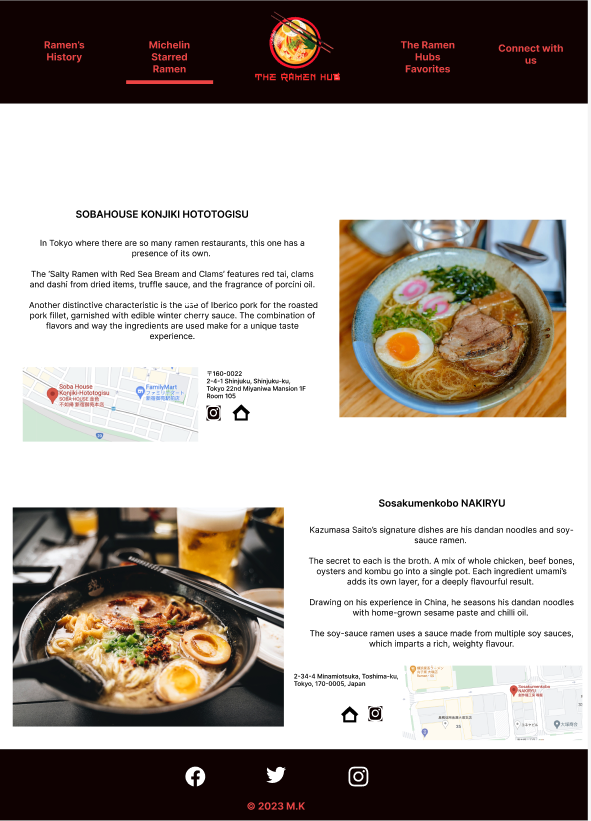

# **The Ramen Hub**

## **Code Institute Portfolio Project I**

## **Contents**

- [Background](#background)
- [Strategy](#strategy)
- [Scope](#scope)
- [User Experience](#user-experience)
    - [Target audiance](#target-audience)
    - [User Stories](#user-stories)
- [Wireframes](#wireframes)
- [Design Choices](#design-choices)
    - [Color palette](#color-palette)
    - [Typography ](#typography)
    - [Images ](#images)
- [Features](#features)
    - [Logo](#logo)
    - [Navigation Menu ](#navigation-menu)
    - [Homepage ](#homepage)
    - [The Ramen Hubs Favorites ](#the-ramen-hub-favorites)
    - [Contact ](#contact)
    - [Footer ](#footer)
- [Future Features](#future-features)

## **Background**
 One of my great passions is traveling and I was lucky enough to be able to visit Tokyo. For foodies like me the city is culinary heaven but at the same time a real nightmare, when it comes to options.

I love Ramen and Tokyo has over 10 000 Ramen houses to choose from.  I have tried several different shops and wanted to share my favorites. Since there are so many different styles of Ramen, I tried to include a variety and of course the only two Ramen shops with Michelin Stars. 

So, if you plan on visiting Tokyo, I hope *The Ramen Hub* will be helpful when making the choice of which restaurant to visit. 

## **Strategy**
The idea behind *The Ramen Hub* is providing a site where travelers can find a handful of Ramen shops in Tokyo. Since the city is so huge and food is an essential part of the culture options seem endless, and all the information can be overwhelming. Travelers having difficulties with the mostly Japanese websites can find short descriptions in English that will give them a foretaste of the restaurants specialty Ramen.

## **Scope**
The Scope of this project is creating a website with the HTML and CSS framework. Users can find a curated list of Ramen shops in Tokyo with English descriptions of the restaurants, the locations on google maps and are provided with the links to homepages of the shops. Users can also submit their own favorite Ramen shop to eventually grow The Ramen Hub. 

## **User Experience UX**

**Target Audience**

This site is aimed at anyone traveling to Tokyo who needs help with all the information online and the options given surrounding Ramen. 

**User Stories**

- As a First Time User
    - I can navigate through the site to find the information I need. 
    - I can find out more about The Ramen Hub and the idea behind it.
    - I can find links to the websites of the listed Ramen shops. 
    - I can find the locations to the listed Ramen shops.
    - I can submit the name and location of my favorite Ramen restaurant. 

- As a Returning User
    - I can use the site as a guide when planning on visiting Tokyo. 
    - I can visit the websites of the different spots to get more information. 

- User Goals 
    - To be able to view the site on a selected range of device seizes. 
    - To be able to get directions to the Ramen shops via google maps.
    - To be able to find a good selection of Ramen shops in Tokyo, Japan.
    - To be able to submit a personal suggestion. 

## **Wireframes**

The Wireframes where created using Figma. Not all of the pages where developed for the time being and the structure was refactored during the process. The additional Wireframes can be used for future Features.

Homepage:

Favorites page:

Contact page:

### Wireframes for future page development:

History page

Michelin Starred page

## **Design Choices**
**Color Palette**

The idea behind the color palette was reflecting the mood of a typical alley in Tokyo by night.  With red lights from lanterns reflecting on the dark street. 

**Typography**

The Fonts used were Nunito Sans and Scada.

**Images**

## **Features**

The website has three pages Home, The Ramen Hubs Favorites and Connect with us. All pages are accessible from the navigation menu. The Logo and Home both link to the landing page.

**Logo**

-	The logo features a bowl of Ramen with the website name under it.
-	It appears in the site main colors being black and red to get in the mood of late-night Tokyo streets. 

**Navigation Menu**

-	The Navbar is at the top of every page to assure easy navigation throughout the different pages. 
-	On the left the logo is placed which when clicked brings the user back to the landing page. 
-	On the right you can find the links to the website pages. 

**Homepage**

-	The first thing the user will see is a Japanese word, it says welcome. 
-	Under the welcome section you will find a short background story and what the the purpose of the site.
-	The overview section is displayed as circles that give a short description of what can be expected from the following pages. 
-	As background picture I chose an image of a street in Tokyo by night, which reflects the main site colors and mood. 

**The Ramen Hubs Favorite Page**

The site is organized with cards. On each card you will find:
-	an image of the specialty Ramen 
-	the name of the Ramen shop
-	an icon that links to each Ramen shops own website
-	the location on google maps

**Contact Page**
-	Features a heading describing what can be submitted with the form.
-	Form features fields for users to enter their name and email address.
-	A text-field in which the user can enter the name and location of their personal favorite Ramen shop.
-	The user can submit their input by using the submit button.
-	As background I chose an image of an elderly man eating Ramen. The colors in the image and the mood reflect the theme of the site.

**Footer**

-	Features social media links and Copyright.
-	The footer can be found on the bottom of every page.

**Future Features**

-	Implement the *Michelin Starred Ramen* page as designed in the [Wireframe](#wireframes-for-future-page-development), to structure all the shops better and simplify the navigation for the user.

-	Implement *The Ramen History* page as designed in the [Wireframe](#wireframes-for-future-page-development) to give the user more information about the dish. 

## **Technologies Used**

### **Languages**
The languages used to create this website were HTML and CSS.

### **Frameworks & Tools**
* Figma was used for creating the wireframes. 
* GitHub and Git were used as host plattform and version control.
* Gitpod as IDE for writing and editing code.
* Google Dev Tools were used to test features and support with the responsiveness and styling of the website.
* [Canva](#https://www.canva.com/create/logos/) was used to create the Logo. 
* [Am I Responsive](#https://ui.dev/amiresponsive) was used to display the website on a range of devices.

