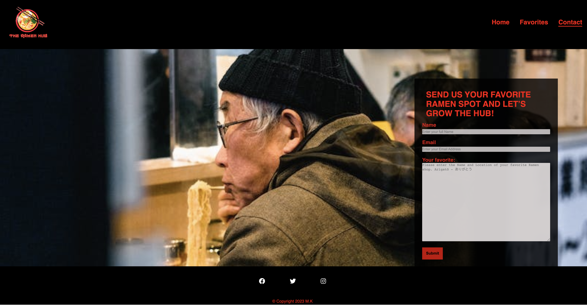
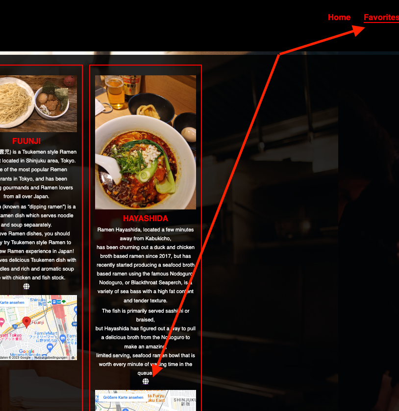
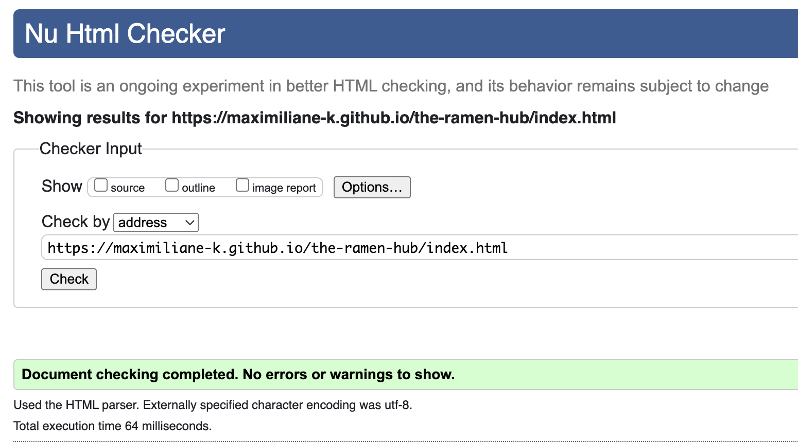
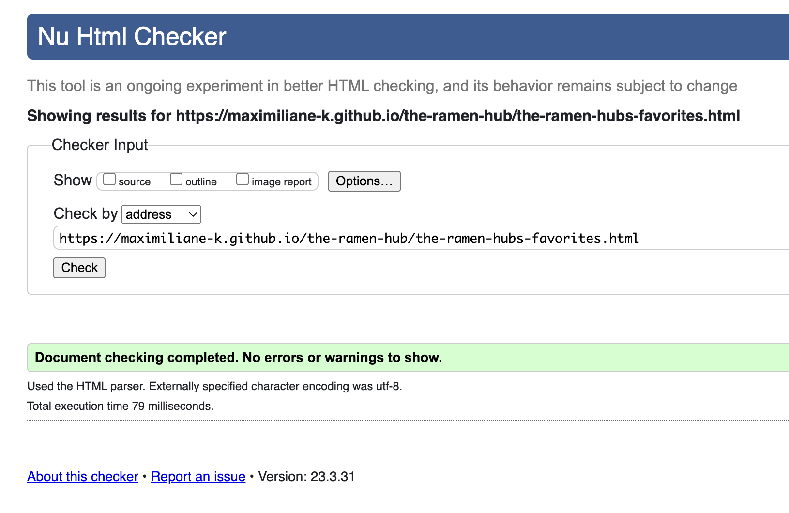
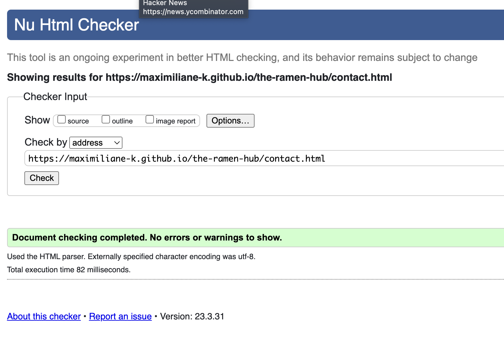
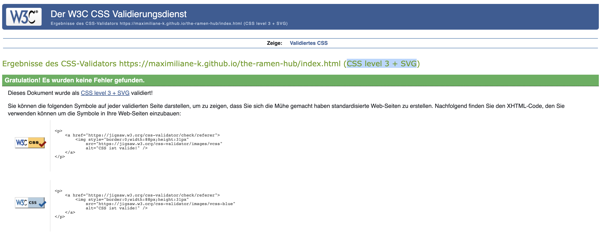
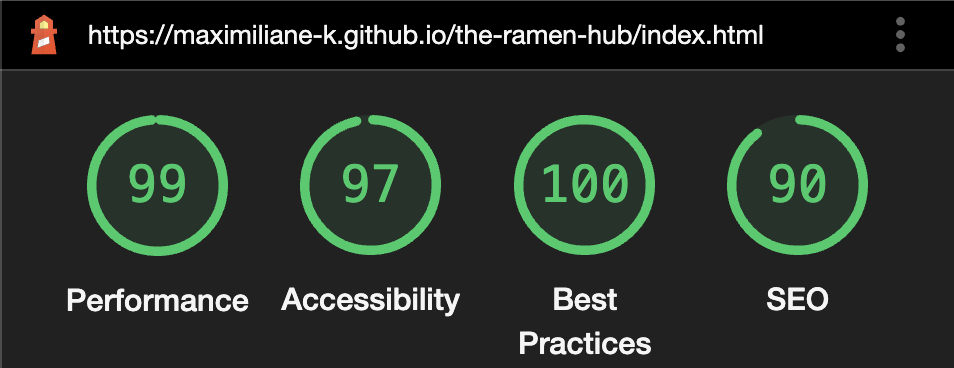
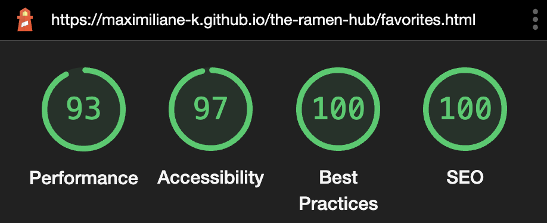
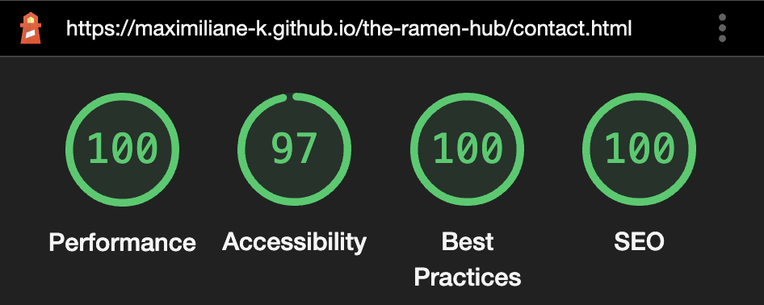

# **The Ramen Hub**

## **Code Institute Portfolio Project I**

## **Background**
 One of my great passions is traveling and I was lucky enough to be able to visit Tokyo. 
 
 For foodies like me the city is culinary heaven but at the same time a real nightmare when it comes to options.

I love Ramen and Tokyo has over 10 000 Ramen shops to choose from.  I have tried several different shops and wanted to share my favorites. Since there are so many different styles of Ramen I tried to include a variety of styles and of course the only two Ramen shops with Michelin Stars. 

So if you plan on visiting Tokyo I hope *The Ramen Hub* will be helpful when making the choice of which restaurant to visit. 

[The Ramen Hub on GitHub Pages](https://maximiliane-k.github.io/the-ramen-hub/index.html)
## **Contents**

* [Background](#background)
* [Strategy](#strategy)
* [Scope](#scope)
* [User Experience UX](#user-experience-ux)
    * [Target audience](#target-audience)
    * [User Stories](#user-stories)
* [Wireframes](#wireframes)
* [Design Choices](#design-choices)
    * [Color Palette](#color-palette)
    * [Typography](#typography)
* [Features](#features)
    * [Logo](#logo)
    * [Navigation Menu ](#navigation-menu)
    * [Homepage ](#homepage)
    * [The Ramen Hubs Favorites ](#the-ramen-hub-favorites)
    * [Contact ](#contact)
    * [Footer ](#footer)
    * [Future Features](#future-features)
* [Bugs and Challenges](#bugs-and-challenges)
* [Technologies Used](#technologies-used)
* [Deployment](#deployment)
* [Development](#development)
* [Testing](#testing)
    * [User Stories](#user-stories)
    * [First time user](#first-time-user)
    * [Returning user](#returning-user)
    * [Manuel testing](#manuel-testing)
* [Validation](#validation)
* [Lighthouse](#lighthouse)
    * [Accessibility](#accessibility)
* [Credits](#credits)
    * [Code](#code)
    * [Content](#content)
    * [Images](#images)
    * [Acknowledgments](#acknowledgments)

## **Strategy**
The idea behind *The Ramen Hub* is providing a site where travelers can find a handful of Ramen shops in Tokyo. Since the city is so huge and food is an essential part of the culture options seem endless, and all the information found online can be overwhelming. 

Travelers having difficulties with the mostly Japanese websites can find short descriptions in English that will give them a foretaste of the restaurants specialty Ramen.

## **Scope**
The Scope of this project is creating a website with the HTML and CSS framework. Users can find a curated list of Ramen shops in Tokyo with English descriptions of the restaurants, the locations on google maps and are provided with the links to homepages of the shops. Users can also submit their own favorite Ramen shop to eventually grow The Ramen Hub. 

## **User Experience UX**

### **Target Audience**

This site is aimed at anyone traveling to Tokyo who needs help with all the information online and the options given surrounding Ramen. 

### **User Stories**

- As a First Time User
    - I can navigate through the site to find the information I need. 
    - I can find out more about The Ramen Hub and the idea behind it.
    - I can find links to the websites of the listed Ramen shops. 
    - I can find the locations to the listed Ramen shops.
    - I can submit the name and location of my favorite Ramen restaurant. 

- As a Returning User
    - I can use the site as a guide when planning on visiting Tokyo. 
    - I can visit the websites of the different spots to get more information. 

- User Goals 
    - To be able to view the site on a selected range of device seizes. 
    - To be able to get directions to the Ramen shops via google maps.
    - To be able to find a good selection of Ramen shops in Tokyo, Japan.
    - To be able to submit a personal suggestion. 

## **Wireframes**

The wireframes where created using Figma. Not all of the pages where developed for the time being and the structure was refactored during the process. The additional wireframes can be used for future features.

Homepage:

Favorites page:

Contact page:

### Wireframes for future page development:

History page

Michelin Starred page

## **Design Choices**
**Color Palette**

The idea behind the color palette was reflecting the mood of a typical alley in Tokyo by night.  With red lights from lanterns and yellow lights from the street lanterns reflecting on the dark street. 

**Typography**

The Font used is [Nunito Sans](https://fonts.google.com/specimen/Nunito+Sans). It's a sans serif typeface superfamily. The font reminded me of Tokyo, the feel is sleak and modern in it's basic style.

## **Features**

The website has three pages *Home*, *Favorites* and *Contact*. All pages are accessible from the navigation menu. The Logo and Home both link to the landing page.

### **Logo**

-	The logo features a bowl of Ramen with the websites name, *The Ramen Hub*, under it.
-	It appears in the site main colors being black and red to get in the mood of late-night Tokyo streets. 
- The logo was created using Canva.com.

### **Navigation Menu**

-	The Navbar is at the top of every page to assure easy navigation throughout the different sites. 
-	The logo is placed on the left which when clicked brings the user back to the landing page. 
-	On the right you can find the links to the website pages. 

### **Homepage**

-	On top of the page you see the word *welcome* in Japanese, followed by a shoprt welcome in English. 
-	Under the welcome section you will find a short background story and the purpose of the site.
-	The overview section is displayed as circles that give a short description of what can be expected from the following pages. 
-	As background picture I chose an image of a street in Tokyo by night, which reflects the main site colors and mood. 

### **Favorites Page**

The site is organized with cards. On each card you will find:
-	an image of the specialty Ramen
-	the name of the Ramen shop
-	an icon that links to each Ramen shops own website
-	the location on google maps

### **Contact Page**

-	Features a heading describing what can be submitted with the form.
-	The form features fields for users to enter their name and email address.
-	A text-field in which the user can enter the name and location of their personal favorite Ramen shop.
-	The user can submit their input by using the submit button.
-	As background I chose an image of an elderly man eating Ramen. The colors in the image and the mood to me reflects the mood of the website.

### **Footer**

-	Features social media links and Copyright.
-	The footer can be found on the bottom of every page.

### **Future Features**

-	Implement the *Michelin Starred Ramen* page as designed in the [Wireframe](#wireframes-for-future-page-development), to structure all the shops better and simplify the navigation for the user.
-	Implement *The Ramen History* page as designed in the [Wireframe](#wireframes-for-future-page-development) to give the user more information about the dish.
- A sticky header would be a great addition if the registry of the Ramen shops grow to help users navigate the site more easily.
- With a growing hub a pagination bar would be a nice feature to implement. 

## **Bugs and Challenges**

1.	The biggest challenge was making the nav-bar and the info-circles on the landing page responsive. 

-	In the beginning the name of the favorites page was *The Ramen Hubs Favorites* and the contact page was named *Connect with us*. Unfortunately, the long text didn’t display nicely on small screens. They took up too much space, so the font needed to be extremly small which made it difficult to read the nav-bar. This is bad UX so I decided to shorten the length of the list items to make it visually more appealing. 

-	Making the two circles responsive was quite a challenge since I first went the route of positioning them using left, right and top properties. I changed my approach and then used the Flexbox instead. This made the task way easier nevertheless getting the two circles responsive on the smallest screen size (320px) needed a lot of attention to detail. I decided to let them transition from circles, to one text-box separated by a red border and the last transition into two slim boxes. 

2.	Another challenge was getting the background images positioned. 

-	I started with giving the images fixed width and height attributes to fill out the space. When coming to the point of making them responsive this didn’t work, and the images were either not visible or cropped. I then changed my approach and used the property of width: 100% and padding-bottom. 

## **Technologies Used**

### **Languages**
The languages used to create this website were HTML and CSS.

### **Frameworks & Tools**
* Figma was used for creating the wireframes. 
* GitHub and Git were used as host plattform and version control.
* Gitpod as IDE for writing and editing code.
* Google Dev Tools were used to test features and support with the responsiveness and styling of the website.
* [Canva](#https://www.canva.com/create/logos/) was used to create the Logo. 
* [Am I Responsive](#https://ui.dev/amiresponsive) was used to display the website on a range of devices.

## **Deployment**
This site was developed in the [Gitpod](https://www.gitpod.io/) IDE and deployed to GitHub Pages. During development the site was previewed in the browser through Port 8000 in Gitpod by running the command `python3 -m http.server` in the terminal.

### Deploying to Github Pages:
1. Once logged or signed into Github, find the repository to the project.
2. Search for the *Settings* link and then click it.
3. A navigation bar will open on the left. Search for the *Pages* link and click it. 
4. In the *Source* section, choose *Deploy from a branch*.
5. Under this section you will find *Branch*. Choose *Main* and *Root*.
6. Click *Save* and your Github Pages site will be build. 
7. Refresh the page to see the URL the site is deployed to. 

## **Development**
For local development the project repository can be found on GitHub.
-	Log in or sign up to Github.
-	Navigate to my GitHub profil, [Maximiliane-K](https://github.com/Maximiliane-K.).
-	Locate the repository named “The Ramen Hub”.
-	Click on the green *code* button and choose HTTPS, SSH or GitHubCLI and copy the preferred link. 
-	Open the IDE of your choice and create a directory where the repository should be stored using the terminal. 
-	Enter `git clone`, paste the copied URL and press enter.
-	The repository will be cloned to the selected repository. 

## **Testing**
### **User Stories**

First time user:

1. *"I can navigate through the site to find the information I need."*

 This is being ensured with giving the user different options of navigation through out the site. 
 
 The nav-bar links to all the pages and on the landing page there are two info-circles which link directly to the sections they explain. Also the logo serveres as a home-button so the user can easly come back to the landing page. 
 
 All navigation links on the nav-bar and throughout the site work. 
 

 2. *"I can find out more about The Ramen Hub and the idea behind it."*

 On the landing page the user will find a short description of the idea and inspiration behind the website right after the welcome. 
 

3. *"I can find links to the websites of the listed Ramen shops."*

The user is able to find the links on the Favorites page. After providing the user with an image and basic information about the ramen shop, the link to the websites of the Ramen shops are provided via an icon. 

All external links work. 

4. *"I can find the locations to the listed Ramen shops."*

The locations of the listed Ramen shops are build into the cards on the Favorites page via iframe. 

All iframes work.

5. *"I can submit the name and location of my favorite Ramen restaurant."*

The user can submit his own personal favorite Ramen spot if he wishes. He can do this on the contact page via a form. 

The form works and sends the information to the Code Institutes formdump. 

Returning user:

+ *"I can use the site as a guide when planning on visiting Tokyo."*

+ *"I can visit the websites of the different spots to get more information."*

This two user stories are covered by the description found on the Favorites pages. 
These aim to help users get more in depth information about the style of Ramen servered. The user can decide before a trip which option suits their personal itinerary best and which Ramen speciality is served. 

The user can get more information by visiting the website of the preferred Ramen shop linked under the description. 

The exact location and directions are provided bei google maps. 

### **Manuel Testing**
1. Cross Browser Compatibility: 
- The website was tested in the browsers of Google Chrome, Safari and Mozzila Firefox. I tested every link and checked if the images where correctly displayed.
     
    * All links on the site worked as expected.
    * All external links worked as expected and opened in seperate browser tab. 
    * All images are displayed as expected.  

2. Functionality:
- The form was tested and worked as expected.
    * The user is asked to fill in a name, email address and text to be able to submit the form.
    * The form can only be submitted when all required text-input fields are filled.

- The iframes were tested.
    * The iframes are being displayed correctly and are interactive.
    * The iframes open in a seperate browser when clicking on the address. 

3. Responsiveness:
- To ensure that the website is responsive I tested it on several devices.
    * MacBook Pro 16"
    * Dell Monitor 23.8"
    * Samsung Galaxy S22
    * Samsung Galaxy Tab S4

- Google developer tools were used to ensure that the site is responsive on different screen sizes.

### **Validation**
**W3C Validator**

* [index.html](https://validator.w3.org/nu/?doc=https%3A%2F%2Fmaximiliane-k.github.io%2Fthe-ramen-hub%2Findex.html) - no errors found

* [favorites.html](https://validator.w3.org/nu/?doc=https%3A%2F%2Fmaximiliane-k.github.io%2Fthe-ramen-hub%2Findex.html) - no errors found

* [contact.html](https://validator.w3.org/nu/?doc=https%3A%2F%2Fmaximiliane-k.github.io%2Fthe-ramen-hub%2Findex.html) - no errors found

* [style.css](hhttps://jigsaw.w3.org/css-validator/validator?uri=https%3A%2F%2Fmaximiliane-k.github.io%2Fthe-ramen-hub%2Findex.html&profile=css3svg&usermedium=all&warning=1&vextwarning=&lang=de) - no errors found

### **Lighthouse**
To test the performance, accessibility, best practices and SEO of the website, the Google developer tool Lighthouse was used. 

* 
* 
* 

## **Accessibility**
Keeping accessibility in mind during the development process I tried to make the site as accessible as possible to my abilities. I added alt attributes or aria-labels to all images. Whilst choosing the color-scheme I thought about the sufficiency of the color contrast. And by using the semantic web technology writing my HTML code. 

## **Credits**

### **Code**
* The Nav-bar and Footer where inspired by The Code Institutes Love Running project.
* For the grid layout of the favorites-page the following code was used: 
[CSS Grid Layout](https://wpengine.com/resources/card-layout-css-grid-layout-how-to/).
* For the Flexbox on the landing-page the following code was used: [Flexbox](https://css-tricks.com/snippets/css/a-guide-to-flexbox/).

### **Content**

For the text content on the favorites-page the following source were used for inspiration and facts: 

 * https://guide.michelin.com/en/tokyo-region/tokyo/restaurant/sosakumenkobo-nakiryu
 * https://guide.michelin.com/de/de/tokyo-region/tokyo/restaurant/sobahouse-konjikihototogisu
 * https://jw-webmagazine.com/shinjuku-restaurant-guide-vol-11-fuunji-65bc1122c921/
 * http://www.fu-unji.com/index.html
 * https://en.ichiran.com/ramen/
 * https://www.ramenings.com/hayashida

 The content on the page was written by Maximiliane Kaempffer. 

 ### **Images**

 * The background images on the website were obtained from [Pexels](https://www.pexels.com/de-de/).
 * The images of the Ramen soups on the favorites-page are made by Maximiliane Kaempffer. 
 * The Logo was created by Maximiliane Kaempffer using a template on [Canva](https://www.canva.com/create/logos/).
 * The Icons were obtained from [Font Awesome](https://fontawesome.com/v4/icons/).

 ### **Acknowledgments**

 I would like to say thank you to my Code Institue Mentor [Brian O'Hare](https://ie.linkedin.com/in/bjohare) for guiding me through my first own project. 

    
   

    

